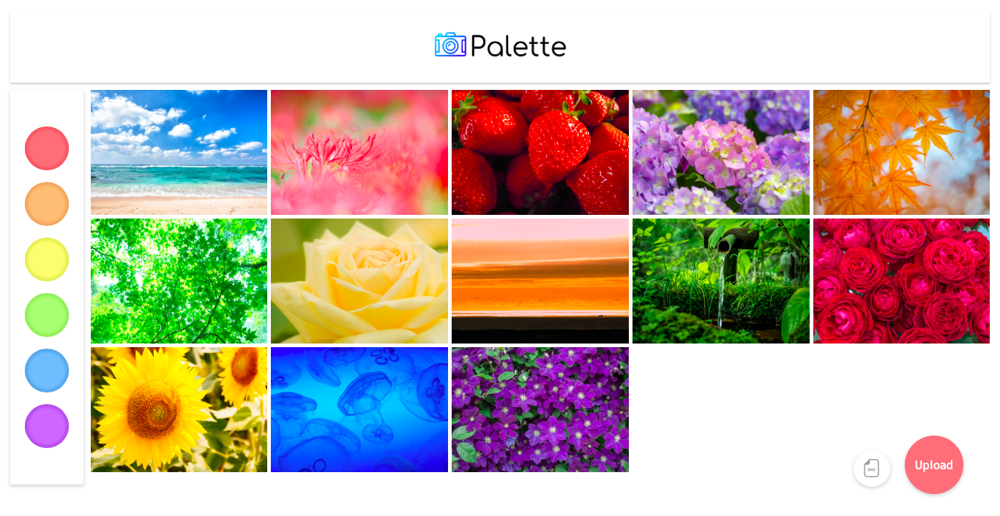
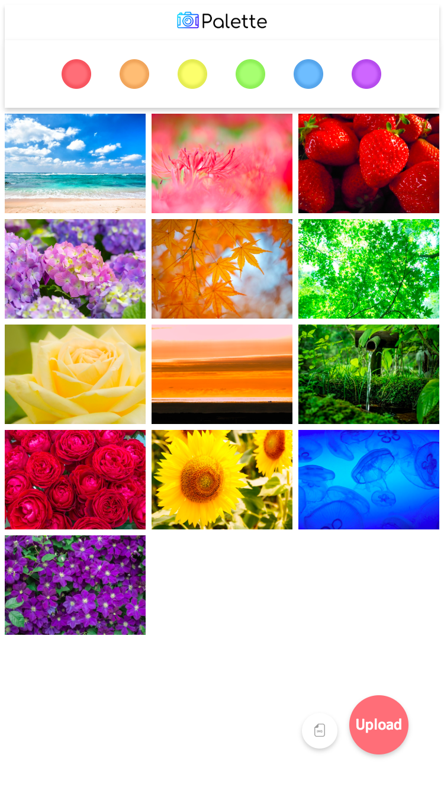

# Palette
色彩を共有するソーシャルwebアプリ  

## Description
Paletteは画像を色分けして共有するソーシャルアプリケーションです  
ユーザは自分の共有したい写真を簡単に投稿することができます  
投稿した写真はクラスタリングによってメインカラーが自動的に抽出され、  
赤、オレンジ、黄、緑、青、そして紫色の6色に分類されます  
またPaletteはレスポンシブデザインにも対応していて、  
あらゆるモバイル端末で写真を共有することができます

## Demo

これがPaletteデスクトップ版のホーム画面です  
ユーザは右下の白いSelectボタンからファイルを選び、Uploadボタンから投稿することができます  
左側には6つのカラーボタンがあり、ボタンを押すとその色がメインカラーの写真だけが表示されます  
ロゴを押すと投稿された全ての写真を見ることができます  

これがPaletteモバイル版です  
ユーザは好きなデバイスから自由に写真を投稿することができます

## Usage
<https://www.pythonanywhere.com>  
にアクセスしてください、ユーザ登録は不要です

## License
ロゴデザイン：<https://www.designevo.com>  
デモ用画像：<https://www.pakutaso.com>
